# Hi there 👋

I'm Timon, a Full Stack Developer based in Kapfenberg, Austria.

---

<table>
<tr>
<td valign="top" width="50%">

</td>
<td valign="top" width="50%">

## Latest blog posts

<!-- blog start -->
[Thoughts on Crowdstrike and Anesthesiology](https://blog.dertimonius.dev/posts/til-29/) - 2024-07-22

[Digging deep into CLI tools](https://blog.dertimonius.dev/posts/til-28/) - 2024-07-16

[Animating code blocks](https://blog.dertimonius.dev/posts/til-27/) - 2024-05-08

[The long way to become a small, angry Vim user](https://blog.dertimonius.dev/posts/til-26/) - 2024-04-10

[Mental Health, Open Source and the xz backdoor](https://blog.dertimonius.dev/posts/til-25/) - 2024-04-02
<!-- blog end -->

You can read more on [dertimonius.dev](https://dertimonius.dev)

</td>
</tr></table>
