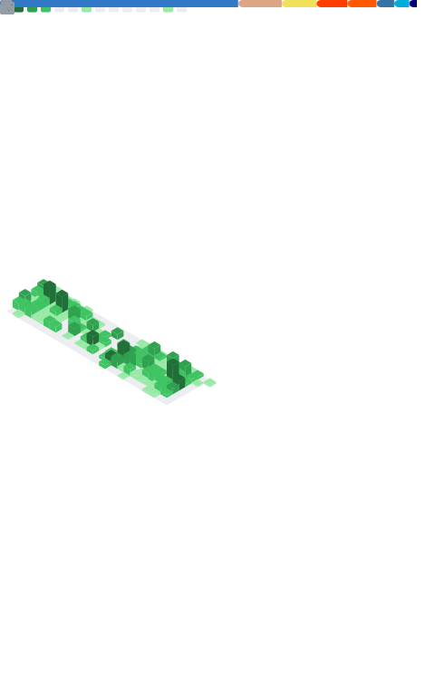

# Hi there 👋

I'm Timon, Lead Developer @ [ava](https://ava.services), Backend Architect @ [realitiq](https://realtiq.com)

---

<table>
<tr>
<td valign="top" width="50%">

</td>
<td valign="top" width="50%">

## Latest blog posts

<!-- blog start -->
[Releasing my first npm package: ec-lang-logo](https://blog.dertimonius.dev/posts/til-38/) - 2026-03-04

[Moving from Elasticsearch to Meilisearch: the good, the bad, the surprise](https://blog.dertimonius.dev/posts/til-37/) - 2026-02-17

[Solving API Validation with TypeScript's Weirdest Type Tricks](https://blog.dertimonius.dev/posts/til-36/) - 2025-07-12

[The most satisfying (and useless) TypeScript type](https://blog.dertimonius.dev/posts/til-35/) - 2025-06-11

[Why I avoid enums in TypeScript](https://blog.dertimonius.dev/posts/til-34/) - 2025-06-01
<!-- blog end -->

You can read more on [dertimonius.dev](https://dertimonius.dev)

</td>
</tr></table>
